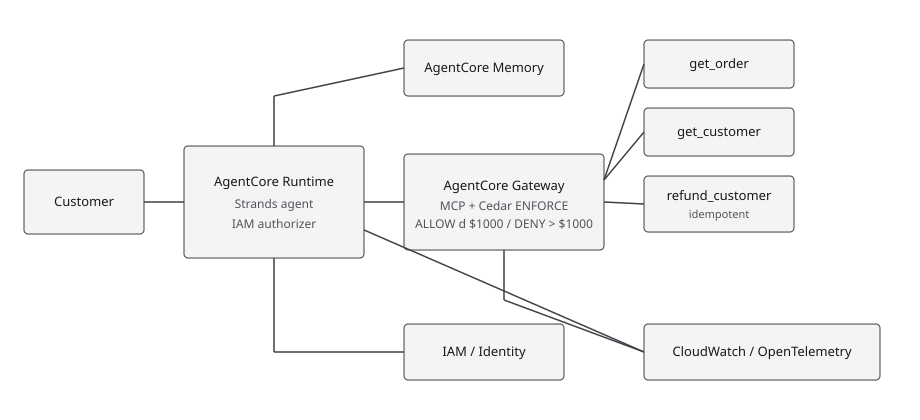
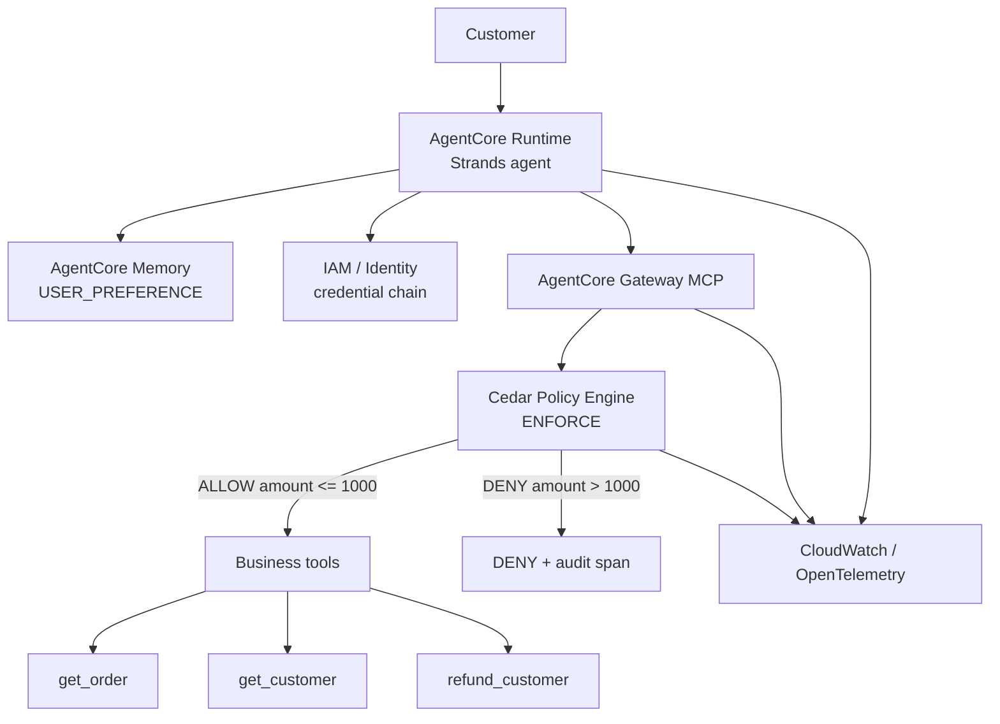

# Architecture



Production-like customer support agent on Amazon Bedrock AgentCore.



## Prompt injection path

```text
LLM requests refund(5000)
        ↓
Gateway
        ↓
Policy
        ↓
DENY
```

The model prompt is not the authorization layer. Cedar at the Gateway is.

## Components

| Piece | Local | AWS |
| --- | --- | --- |
| Agent | `app/SupportAgent/main.py` | AgentCore Runtime |
| Tools | `python -m gateway.mcp_server` | AgentCore Gateway MCP target |
| Policy | `gateway/policy.py` reads `policy/*.cedar` | AgentCore Policy ENFORCE |
| Memory | JSON file by actor_id | AgentCore Memory USER_PREFERENCE |
| Identity | AWS CLI/SSO profile | Runtime execution role + SigV4 MCP |
| Refunds | SQLite + unique idempotency_key | same contract |
| Traces | `evidence/runs/spans.jsonl` | CloudWatch / X-Ray |

## Reliability

`idempotency_key` is required. Replay of `operation-123` returns the original
refund. Retryable HTTP 500 uses exponential backoff. Timeouts are not retried.
